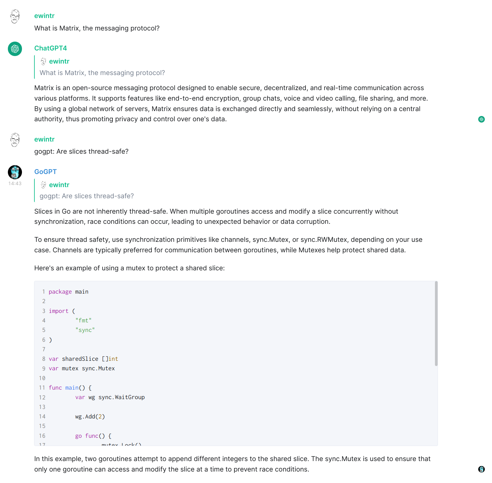

# Matrix-GPTZoo

A Matrix bot version of ChatGPT, with multiple configurable prompts.

The bot will log in with a different user for each prompt, making it possible to create a chat room full of AI assistants you can ask questions.

Bots will only answer questions specifically addressed to them, but it is also possible to configure one to answer questions that are not addressed to a specific bot. Continuing a conversation can be done by replying to an answer.



## Configuration

Configuration consists of two parts: a toml file that defines the prompt and environment variables for the passwords and keys. Matching environment variables to the bots in the toml is done on the Matrix user ID.

This probably best explained with an example:

```toml
[[Bot]]
DBPath = "gpt4-bot.db"
Pickle = "hi-there"
Homeserver = "https://ewintr.nl"
UserID = "@chatgpt4:ewintr.nl"
UserDisplayName = "ChatGPT4"
SystemPrompt = "You are an encouraging chatbot that likes to help people by providing answers in a creative and fun way."
AnswerUnaddressed = true

[[Bot]]
DBPath = "go-bot.db"
Pickle = "hi-there"
Homeserver = "https://ewintr.nl"
UserID = "@gogpt:ewintr.nl"
UserDisplayName = "GoGPT"
SystemPrompt = "You are an export on the programming language Go, you assume that any programming question is about Go and your answers are aimed at senior level developers."
AnswerUnaddressed = false
```

Together with:

```
OPENAI_API_KEY=secret

CONFIG_PATH=/config.toml

MATRIX_BOT0_ID=@chatgpt4:ewintr.nl
MATRIX_BOT0_PASSWORD=secret
MATRIX_BOT0_ACCESS_KEY=secret

MATRIX_BOT1_ID=@gogpt:ewintr.nl
MATRIX_BOT1_PASSWORD=secret
MATRIX_BOT1_ACCESS_KEY=secret

MATRIX_ACCEPT_INVITES=false
```